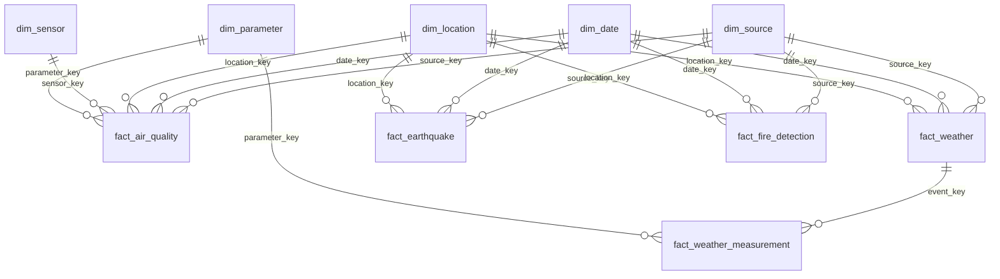

# Data model v3 (Spark/Parquet) — môi trường

## Các tầng

- Bronze: message Kafka nguyên gốc + metadata vận chuyển, không sửa.
- Silver: bốn bảng sạch, mỗi event chỉ giữ phiên bản hợp lệ mới nhất.
- Gold: mô hình fact–dimension có kiểm tra PK/FK bằng code trước khi ghi output.
- `daily_events`/`daily_metrics`: bảng tổng hợp bổ sung từ cùng tập Silver; không
  thay thế các fact. Chúng giữ tên nguồn/location_id để tương thích dashboard cũ.

## Grain và khóa của Silver

| Bảng | Một dòng đại diện cho | Khóa logic |
|---|---|---|
| silver_earthquake | Một sự kiện động đất, phiên bản mới nhất | source + event_id |
| silver_fire_detection | Một phát hiện điểm nóng của vệ tinh | source + event_id |
| silver_weather | Một bộ thông số ở địa điểm/thời điểm | source + event_id |
| silver_air_quality | Một số đo sensor trong khoảng đo | source + event_id |

Tên event_id do ingestion quyết định; transform không suy đoán một ID nguồn mới.
Các bảng dùng metadata sạch chung (UTC, tọa độ số, metrics có đơn vị), trường
`dimensions` giữ thuộc tính chuyên biệt. OpenAQ có thêm `period_end` nếu nguồn cung cấp.
Silver dùng Parquet với các cột struct/array tường minh; Gold tách thành các bảng có khóa liên kết.

## Dimension

| Bảng | PK | Grain / quy tắc |
|---|---|---|
| dim_source | source_key | Một nguồn API |
| dim_date | date_key = YYYYMMDD | Một ngày UTC, có năm/quý/tháng/ngày/ISO weekday |
| dim_location | location_key | Phiên bản vị trí theo nguồn, ID địa điểm và tọa độ |
| dim_sensor | sensor_key | Phiên bản sensor theo nguồn, ID sensor, vị trí và parameter |
| dim_parameter | parameter_key | Một chỉ số + đơn vị + nguồn |

Các khóa ngoài date_key là SHA-256 của các thành phần định danh được serialize ổn định,
không dùng số thứ tự theo lượt chạy. Cùng danh tính có cùng khóa khi rebuild.

`dim_location` và `dim_parameter` có FK source_key. `dim_sensor` có FK source_key,
location_key và parameter_key. Hai nguồn có cùng tọa độ vẫn là hai location khác nhau:
chưa có bảng mapping hoặc spatial join xác nhận chúng là cùng địa điểm.

## Fact

Các fact chính có PK `event_key = hash(source, event_id)` và các FK bắt buộc
`source_key`, `date_key`, `location_key`. Kèm observed_at, ingested_at,
source_updated_at, payload_hash và Kafka lineage để truy vết về Bronze.

| Bảng | Grain | Nội dung riêng |
|---|---|---|
| fact_earthquake | Một sự kiện USGS | magnitude, magnitude_parameter_key, depth_km, depth_parameter_key, status |
| fact_fire_detection | Một phát hiện điểm nóng | frp_mw, frp_parameter_key, satellite, instrument, confidence |
| fact_weather | Một bộ thời tiết tại địa điểm/thời điểm | Metadata chung; số đo ở bảng con |
| fact_air_quality | Một số đo sensor trong khoảng thời gian | sensor_key, parameter_key, value, period_end |
| fact_weather_measurement | Một chỉ số trong một event thời tiết | measurement_key (PK), event_key (FK), parameter_key (FK), value |

Bảng thời tiết con tránh thêm cột mỗi khi API thêm một chỉ số. Khi đếm số bộ thời
 tiết dùng fact_weather; khi tổng hợp chỉ số dùng fact_weather_measurement. Không
đếm sau join một-nhiều mà thiếu DISTINCT event_key.

## Cập nhật và chất lượng

- Fact latest-state: bản sửa giữ event_key, thay số đo và FK liên quan trong snapshot mới.
- USGS ưu tiên source updated; nguồn khác dùng ingested_at, payload_hash phá hòa.
- Location/sensor đổi thuộc tính định danh tạo khóa phiên bản mới. Nhãn location_name
  cập nhật Type 1 trong snapshot theo bản mới nhất được quan sát; không lưu valid_from/
  valid_to. Đây chưa phải SCD Type 2 đầy đủ. Bronze giữ lịch sử nếu cần dựng SCD2 sau.
- Tọa độ là phiên bản quan sát theo dữ liệu nguồn, không phải danh mục địa giới hành chính.
- Unknown latitude/longitude giữ null; khóa location vẫn có namespace nguồn, không tự
  gán về 0 hoặc ghép nguồn. Số đo thiếu không thay thành 0.
- OpenAQ phải có một số đo hợp lệ và sensor id; khoảng đo kết thúc không trước bắt đầu.
- Từng bảng có PK duy nhất; mọi FK phải tồn tại. Kiểm tra model thất bại thì không công
  bố Gold. MinIO không thực thi SQL constraint: `transforms/spark/gold.py` thực hiện kiểm tra bằng DataFrame.
  `transforms/model.py` giữ mô hình Python tham chiếu để đối chiếu trong tests.
- Magnitude giữ thang đo riêng, không trộn Mw và ML. Điểm nóng NASA không phải số vụ cháy.

## Công bố và migration

Manifest v3 chứa `silver_tables` (4 bảng) và `gold_tables` (5 dimension + 5 fact + 2 bảng tổng hợp),
mỗi bảng có directory key và format=parquet. Gold còn có 2 bảng tổng hợp. Các file nằm dưới snapshots/<id>/.
Reader mở `gold/<prefix>/latest.json`, rồi đọc bảng theo manifest đó để không trộn snapshot.

Manifest v1/v2 không được job Gold v3 xử lý trực tiếp. Chạy lại toàn bộ pipeline từ Bronze
để tạo v3; không xóa snapshot cũ. Reader cũ dùng silver_key cần chuyển sang silver_tables.

Đây là data model trên object store với Parquet, chưa phải SQL warehouse/Delta/Iceberg.
Spark xử lý dữ liệu phân tán; full rebuild và yêu cầu giữ toàn bộ Bronze vẫn áp dụng. Không chạy nhiều publisher
trên cùng prefix. Airflow giới hạn một DAG run; CLI trực tiếp cần được vận hành riêng.
